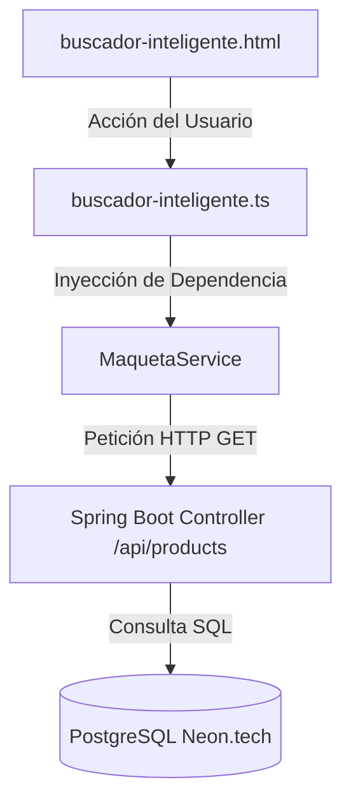

# Documentación de Integración: Buscador Inteligente con Backend

Esta documentación describe la conexión del frontend de la sección de **Inicio** (específicamente el componente `BuscadorInteligente`) con el servicio backend de Spring Boot, implementada para reemplazar el listado de datos estáticos locales y consumir datos dinámicos de PostgreSQL en Neon.

---

## 1. Arquitectura de Conexión

La integración se realiza a través de las siguientes capas del frontend de Angular:



---

## 2. Detalles del Backend (Endpoint)

El componente se conecta al siguiente endpoint público del backend:

- **URL del Endpoint:** `/api/products`
- **Método HTTP:** `GET`
- **Parámetros de Consulta:**
  - `search` (opcional): Filtro de texto para buscar coincidencias por título, descripción o materiales.
  - `category` (opcional): Filtrado por categoría.
  - `page` (por defecto `0`): Índice de página para paginación.
  - `size` (por defecto `12`): Cantidad de elementos por página.

---

## 3. Implementación en el Frontend

### A. Control de Peticiones y Reactividad (`buscador-inteligente.ts`)

Para evitar saturar el backend con peticiones en cada pulsación de tecla, se implementó un control de flujo reactivo utilizando operadores de **RxJS**:

1. **`Subject` (`busqueda$`)**: Canal por el cual se emiten los términos de búsqueda que ingresa el usuario.
2. **`debounceTime(300)`**: Retrasa la petición 300 ms. Si el usuario sigue escribiendo rápidamente, no se envía ninguna petición hasta que se detenga por ese lapso de tiempo.
3. **`distinctUntilChanged()`**: Evita realizar peticiones consecutivas si el término de búsqueda no ha cambiado realmente.
4. **`switchMap()`**: Cancela automáticamente peticiones anteriores que aún estuvieran en vuelo si el usuario ingresa un nuevo término.

### B. Mapeo de Datos (Adapter Pattern)

Dado que el backend utiliza una estructura de base de datos relacional y el frontend ya poseía interfaces definidas por el equipo, se implementó una función adaptadora (`mapearProducto`) en el componente:

```typescript
private mapearProducto(p: Product): ModelItem {
  return {
    id: 0, // Los IDs del backend son UUID string, se establece temporalmente a 0
    title: p.titulo,
    category: (p.categoriaNombre as any) ?? 'Ciencias',
    level: p.gradoEscolar ?? '',
    imageUrl: p.imageUrl ?? '',
    description: p.descripcion ?? '',
    materials: p.materiales ?? [],
    features: []
  };
}
```

---

## 4. Indicador de Carga y UX (`buscador-inteligente.html`)

Para proporcionar retroalimentación visual al usuario mientras la petición HTTP está en curso, se añadió una bandera `cargando: boolean` en el componente asociada a una animación en la interfaz:

- **Estructura HTML añadida:**
  ```html
  <div class="loading-indicator" *ngIf="cargando">
    <span class="material-icons spinning">autorenew</span>
    Buscando...
  </div>
  ```
- **Control del Estado Vacío:** La vista de "No encontramos resultados" se bloquea dinámicamente si `cargando` es `true`, previniendo parpadeos incómodos para el usuario.

---

## 5. Instrucciones para Pruebas Locales

1. Asegúrate de tener levantado el backend de Spring Boot en el puerto `8080` (`http://localhost:8080`).
2. Verifica que las credenciales de la base de datos de Neon estén vigentes en el archivo `application.properties`.
3. Inicia el servidor de desarrollo del frontend:
   ```bash
   npm run start
   ```
4. Escribe en el buscador del inicio para validar que los resultados se carguen en tiempo real desde la base de datos.
