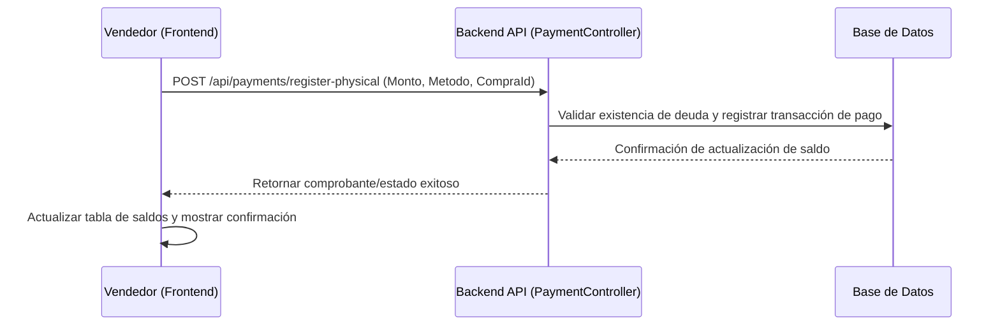

# 📑 Sub-issue 3.5: Acción de registro de cobro físico en la tabla de saldos pendientes

## 🎯 Objetivo
Integrar la funcionalidad para que el vendedor pueda registrar y liquidar saldos pendientes de compras directamente en efectivo (en caja física), actualizando la tabla de saldos pendientes y registrando la transacción de caja.

## 📋 Lista de Tareas
- [ ] **Modificar la UI de Saldos Pendientes:**
  - Agregar columna de acciones en la tabla de saldos.
  - Implementar el botón "Registrar Cobro Físico".
- [ ] **Modal de Registro de Pago:**
  - Crear un modal que se abra al hacer clic en el botón.
  - Campos a completar en el modal: Monto a cobrar (autocompletado con el saldo restante, pero editable si es pago parcial), método de pago presencial (Efectivo, POS, Transferencia Directa), y campo para notas o número de operación del POS.
- [ ] **Endpoint y Lógica de Backend:**
  - Conectar el botón con el servicio `PaymentService` para enviar la transacción al backend.
  - El backend debe procesar la transacción y cambiar el estado del saldo pendiente a `LIQUIDADO` (o actualizar el saldo restante si es pago parcial).

## 📊 Flujo de la Transacción

## 🧪 Plan de Verificación
1. Validar que la tabla liste correctamente las compras con saldos pendientes (50% restante u otros montos).
2. Probar registrar un cobro físico total (debe desaparecer o marcarse como `Pagado` en la tabla de saldos).
3. Probar registrar un cobro físico parcial (debe recalcular y mostrar el nuevo saldo pendiente restante).
